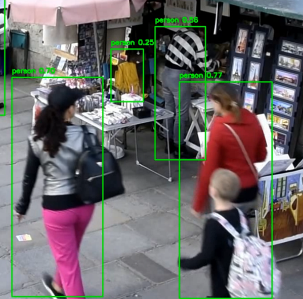

Задача была выполнена при помощи модели YOLOv5s (small).

(результат - [media/output.mp4](media/output.mp4))

Модель работает достаточно быстро и обеспечивает точную детекцию людей в большей части кадра:

Однако, при более сложных условиях (большое расстояние, перекрытия) могут возникать ошибки в детекции.
Так же модель может ошибиться и "случайно":

Для дальнейшего улучшения качества можно воспользоваться более мощными моделями (YOLOv5m, YOLOv5lб YOLOv5x), однако это сильно замедлит обработку.
Так же может помочь предобработка видео (например выравнивание яркости, возможно улучшение качества при помощи ml).